# MERN-STACK-IMPLEMENTATION AWS

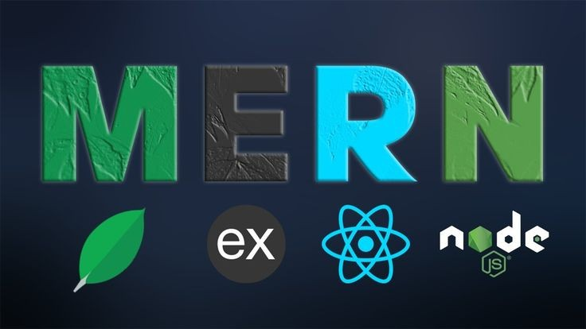

MERN stack is a collection of technologies that enables faster application development. It is used by developers worldwide. The main purpose of using MERN stack is to develop apps using JavaScript only. This is because the four technologies that make up the technology stack are all JS-based.

The four technologies are:

- MongoDB : This is document-based, No-SQL database used to store application data in a form of documents.
- ExpressJS:  This is a server-side Web Application framework for Node.js.
- React: This is a frontend framework developed by Facebook. It is based on JavaScript, used to build User Interface (UI) components.     
- NodeJS:This is a JavaScript runtime environment. It is used to run JavaScript on a machine rather than in a browser.
#  Project Overview:
   We are going to install and illustrate how a user interacts with the ReactJS UI components at the application front-end residing in the browser. This frontend is served by the application backend residing in a server, through ExpressJS running on top of NodeJS. Any interaction that causes a data change, request is sent to the NodeJS based Express server, which grabs data from the MongoDB database if required, and returns the data to the frontend of the application, which is then presented to the user.

 # Project prerequisite:
  
 - AWS account (free tier)
 - Basic understanding of setting up an Ec2 Instance.

Lets get the show on the road 🏋️‍♀️😊

# Step 1.
- Sign in to AWS free tier account
-  Launch a new EC2 Instance
-  t2.micro family with Ubuntu Server 22.04 LTS (HVM) image.
-  Create and download a key pair (a .pem key) for connection to the account
-  Launch instance
- Connect to your instance with your .pem key.

# Step 2. Backend Configuration.

- Update ubuntu: `sudo apt update`
- Upgrade ubuntu:  `sudo apt upgrade`
- Get the location of Node.js software from [Ubuntu repositories](https://github.com/nodesource/distributions#deb) This command will load the Node source.

`curl -fsSL https://deb.nodesource.com/setup_18.x | sudo -E bash -`

- Install Node.js with the command below

`sudo apt-get install -y nodejs`

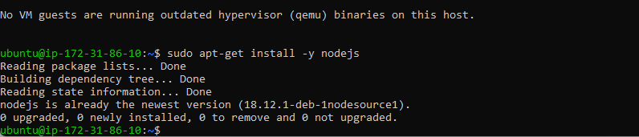

The command above installs both ***nodejs*** and ***npm.***  NPM is a package manager for Node like apt for Ubuntu, it is used to install Node modules & packages and to manage dependency conflicts.
Verify the node installation with the command below:

`node -v`

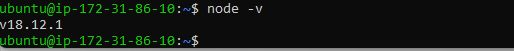

Verify the npm installation with the command below:

`npm -v`

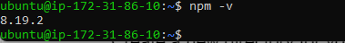 

# Application Code Setup

- Create a new directory for your To-Do project:

`mkdir Todo`

To verify that the Todo directory is created run : 

`ls`

 P.S In order to see some more useful information about files and directories, you can use following combination of keys: 
 
 `ls -lih` 
 
 - It will show you different properties and size in human readable format. 
 - You can learn more about different useful keys for ls command with:
 
  `ls --help`.

Now change your current directory to the newly created one:

`cd Todo`

- To initialise your project, so that a new file named ***package.json*** will be created run:

`npm init`

This initialsied file contains information about your application and the dependencies that it needs to run. Follow the prompts after running the command.
You should press the Enter  key several times to accept default values, then accept to write out the ***package.json*** file by typing yes.

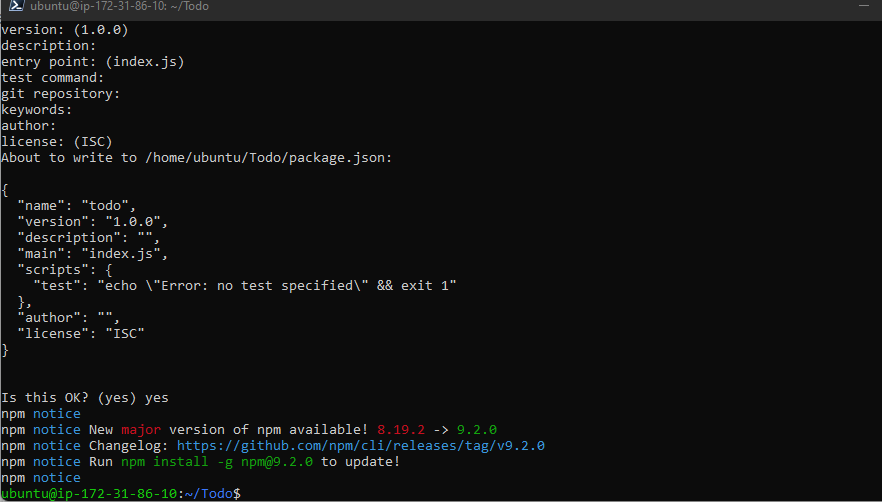 

Run the command `ls` to confirm that you have ***package.json*** file created.


If you do not see the output above, kindly go back and retake all the steps.

# Step 3. Install ExpressJS

- Install, ***ExpressJs*** next and create the ***Routes directory***.
Express is a framework for ***Node.js***, therefore a lot of things developers would have programmed  already comes pre-installed. This singular situation, simplifies development, and abstracts a lot of low-level details. For example, Express helps to define routes of your application based on ***HTTP*** methods and ***URLs***.

- To use express, install it using npm:

`npm install express`

- Create a file ***index.js*** with the command below:

`touch index.js`

- Run `ls` to confirm that your ***index.js*** file has been successfully created

# Install the dotenv module 

- To install the dotenv module run:

`npm install dotenv`

- Open the ***index.js*** file with the command below:

`nano index.js`

Paste the following code in the editor:

```
const express = require('express');
require('dotenv').config();
 
const app = express();
 
const port = process.env.PORT || 5000;
 
app.use((req, res, next) => {
res.header("Access-Control-Allow-Origin", "\*");
res.header("Access-Control-Allow-Headers", "Origin, X-Requested-With, Content-Type, Accept");
next();
});
 
app.use((req, res, next) => {
res.send('Welcome to Express');
});
 
app.listen(port, () => {
console.log(`Server running on port ${port}`)
});

```
Notice that we have specified to use port 5000 in the code. This will be required later when we go on the browser.
Now it is time to start our server to see if it works. Open your terminal in the same directory as your ***index.js*** file and type:

`node index.js`

If your configuration is correct, you should get the following output

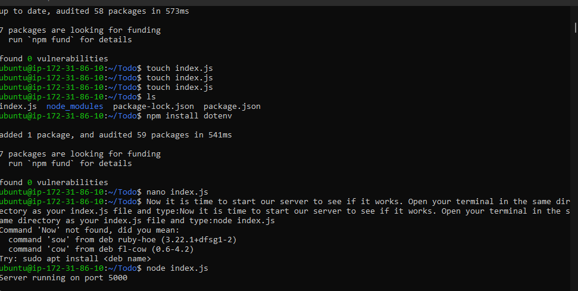

- Open port 5000 in your Ec2 Security groups


Open up your browser and try to access your server’s Public IP or Public DNS name followed by port 5000:

`http://<PublicIP-or-PublicDNS>:5000`

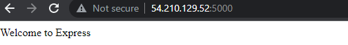

Quick reminder on how to get your server’s Public IP and public DNS name:

-  You can find it in your AWS web console in EC2 details

- For Public IP addresss You can also run:
 
 ```
 curl -s http://169.254.169.254/latest/meta-data/public-ipv4
 
 ```
 - Or

 ```

 curl -s http://169.254.169.254/latest/meta-data/public-hostname
 
 ``` 
 - for Public DNS name.

 # Creating Routes Directory
 
There are three actions that our To-Do application needs to be able to do:

- Create a new task

- Display list of all tasks

- Delete a completed task

Each task will be associated with some particular endpoint and will use different standard ***HTTP request methods***: POST, GET, DELETE.
For each task, we need to create ***routes*** that will define various endpoints that the ***To-do app*** will depend on. 

-  create a folder routes:

`mkdir routes`
  
- Change directory to routes folder:

`cd routes`

Now, create a file api.js with the command below:

`touch api.js`

- Open the file with the command below:

`nano api.js`

- Paste the following code in the file.

```
const express = require ('express');
const router = express.Router();
 
router.get('/todos', (req, res, next) => {
 
});
 
router.post('/todos', (req, res, next) => {
 
});
 
router.delete('/todos/:id', (req, res, next) => {
 
})
 
module.exports = router;
```

# Creating  Models directory.

Because the app is going to  use  Mongodb which is a ***NoSQL*** database, we need to create a model.
A model is at the heart of JavaScript based applications, and it is what makes it interactive.
We will also use models to define the database schema . This is important so that we will be able to define the fields stored in each Mongodb document. 
The Schema is a blueprint of how the database will be constructed, including other data fields that may not be required to be stored in the database. These are known as virtual properties
To create a Schema and a model, install mongoose which is a ***Node.js*** package that makes working with mongodb easier.

- To change directory back Todo folder  run:
 
    `cd ..` and install Mongoose with:

 `npm install mongoose`

-  Create a new folder models with the following command :

`mkdir models`

- Change directory into the newly created ‘models’ folder with:

`cd models`

- Inside the models folder, create a file with the following command and name it todo.js

`touch todo.js`

All three commands above can be defined in one line to be executed consequently with help of && operator, like this:

`mkdir models && cd models && touch todo.js`

- Open the file created with 

`nano todo.js` then paste the code below in the file:

```
const mongoose = require('mongoose');
const Schema = mongoose.Schema;
 
//create schema for todo
const TodoSchema = new Schema({
action: {
type: String,
required: [true, 'The todo text field is required']
}
})
 
//create model for todo
const Todo = mongoose.model('todo', TodoSchema);
 
module.exports = Todo;
```
Now we need to update our routes from the file api.js in ‘routes’ directory to make use of the new model.

-In Routes directory, open api.js with
 
 `nano api.js`
 
  delete the code inside and paste the code below into it then save and exit:

 ```
 const express = require ('express');
const router = express.Router();
const Todo = require('../models/todo');
 
router.get('/todos', (req, res, next) => {
 
//this will return all the data, exposing only the id and action field to the client
Todo.find({}, 'action')
.then(data => res.json(data))
.catch(next)
});
 
router.post('/todos', (req, res, next) => {
if(req.body.action){
Todo.create(req.body)
.then(data => res.json(data))
.catch(next)
}else {
res.json({
error: "The input field is empty"
})
}
});
 
router.delete('/todos/:id', (req, res, next) => {
Todo.findOneAndDelete({"_id": req.params.id})
.then(data => res.json(data))
.catch(next)
})
 
module.exports = router;
```


# MongoDB

The next piece of our application will be the MongoDB Database
We need a database where we will store our data. For this we will make use of mLab.
mLab provides MongoDB database as a service solution [DBaas](https://en.wikipedia.org/wiki/Cloud_database), 
you will need to sign up for a shared clusters free account, which is ideal for our use case.

[sign up here](https://www.mongodb.com/atlas-signup-from-mlab). 
- Follow the sign up process,

- Click on database

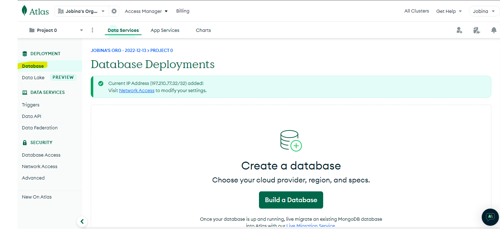

- Click on `buid a database`

- Click on `Create` (our use case is a  free tier account)

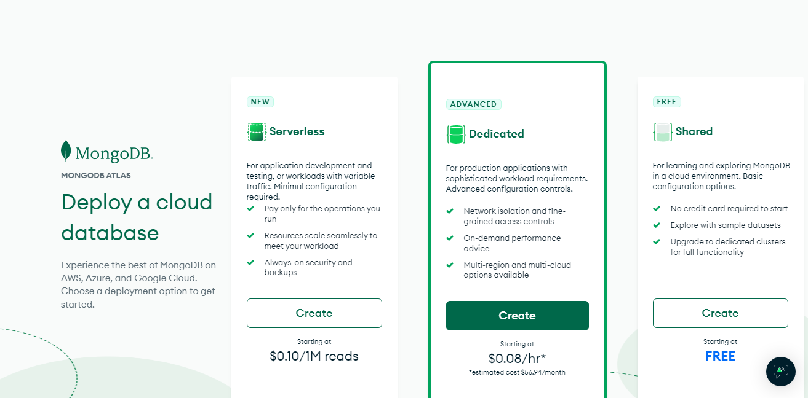

 select AWS as the cloud provider, and choose a region near you.

 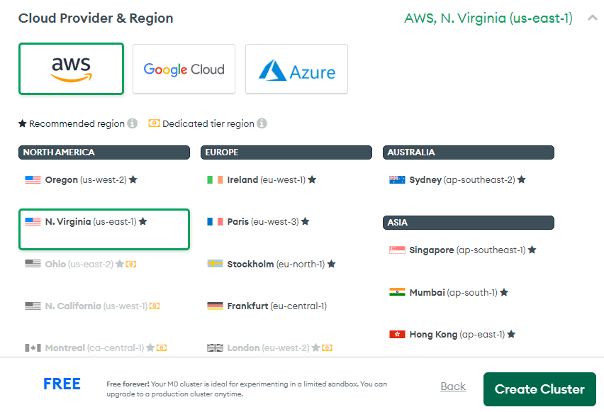

 - Click on Create

 Editing  the following under ***Security quick start** will grant you access to your database

 - Input User name field and password

 - Click `Create user`

 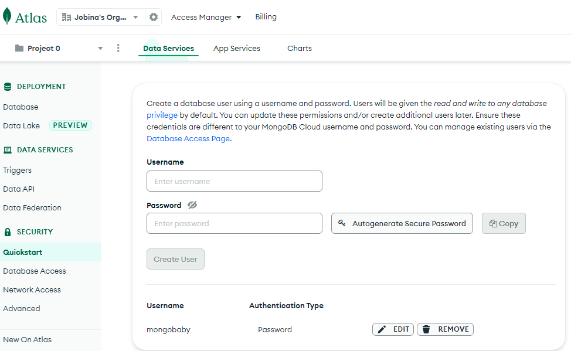

 -  Add entries to your IP access list

 - Click on finish and close 

 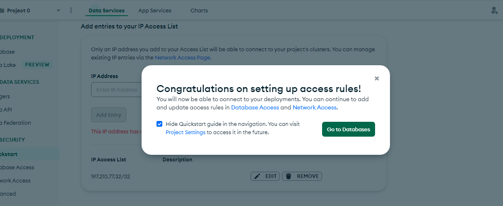 

- Click Go to databases

- Click on all clusters

- Click on cluster name

- Click on collections

 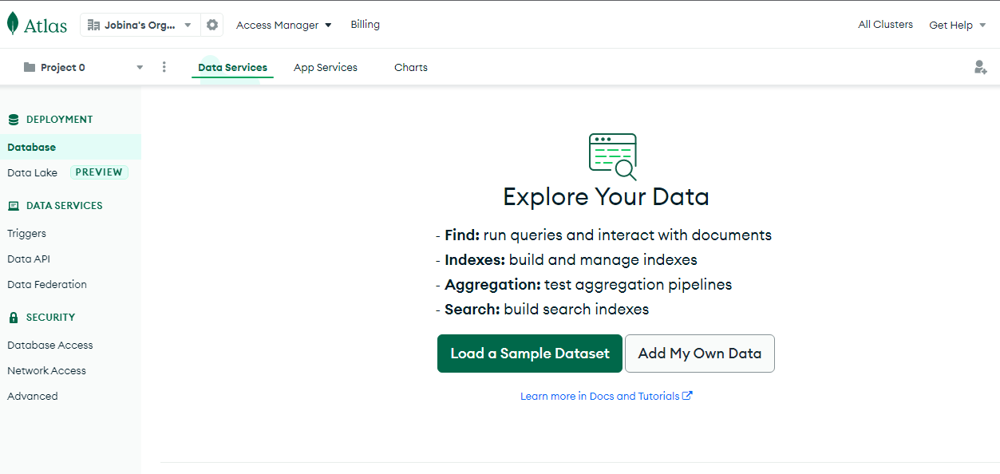 

 We have to connect the database to our webapp.
 
 Under database deployment:

 - Click connect

 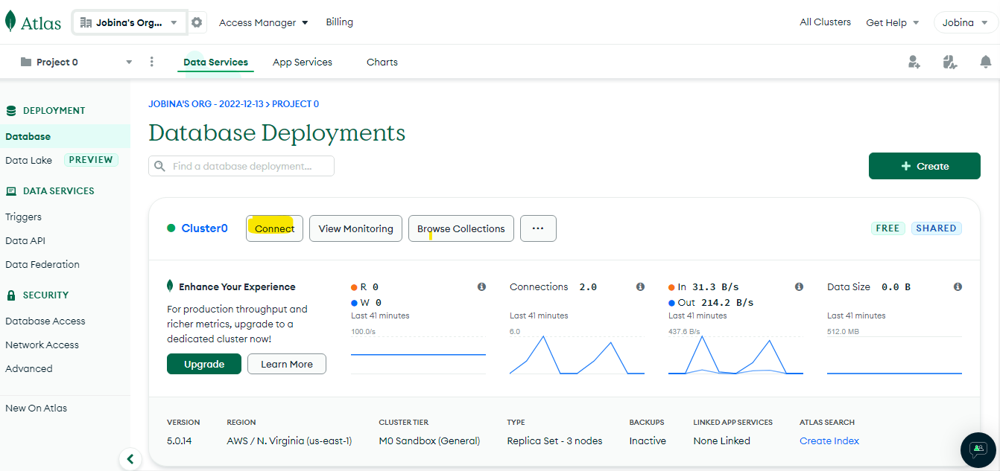

 - Click connect your application

 

In the ***index.js*** file, we specified ***process.env*** to access environment variables, but we have not yet created this file. So we need to do that now.

- Create a file in your Todo directory and name it ***.env*** run:

`touch .env`

`nano .env`

- Paste your connection string. 

- Save and close

Now we need to update the ***index.js*** to reflect the use of ***.env*** so that ***Node.js*** can connect to the database.
Simply delete existing content in the file, and update it with the entire code below.

`nano index.js` (delete the previous content and type in the code below)

```
const express = require('express');
const bodyParser = require('body-parser');
const mongoose = require('mongoose');
const routes = require('./routes/api');
const path = require('path');
require('dotenv').config();
 
const app = express();
 
const port = process.env.PORT || 5000;
 
//connect to the database
mongoose.connect(process.env.DB, { useNewUrlParser: true, useUnifiedTopology: true })
.then(() => console.log(`Database connected successfully`))
.catch(err => console.log(err));
 
//since mongoose promise is depreciated, we overide it with node's promise
mongoose.Promise = global.Promise;
 
app.use((req, res, next) => {
res.header("Access-Control-Allow-Origin", "\*");
res.header("Access-Control-Allow-Headers", "Origin, X-Requested-With, Content-Type, Accept");
next();
});
 
app.use(bodyParser.json());
 
app.use('/api', routes);
 
app.use((err, req, res, next) => {
console.log(err);
next();
});
 
app.listen(port, () => {
console.log(`Server running on port ${port}`)
});
```

Using environment variables to store information is considered more secure and best practice to separate configuration and secret data from the application, instead of writing connection strings directly inside the ***index.js*** application file.

Run:

`node index.js` to start your server

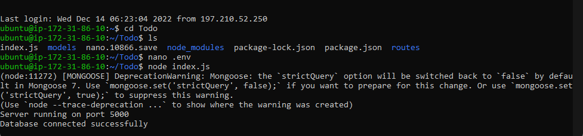

The backend part of our To-Do application is ready: Database has been configured. We however do not have a frontend UI yet. We need ReactJS code to achieve that. But during development, we will need a way to test our code using RESTfulL API. Therefore, we will need to make use of some API development client to test our code.
In this project, we will use [postman](https://www.getpostman.com/) to test our API.

- Click Install Postman to download and install postman on your machine.

- Click [HERE](https://www.youtube.com/watch?v=FjgYtQK_zLE) to learn how perform [Crud](https://en.wikipedia.org/wiki/Create,_read,_update_and_delete) operartions on Postman

All  API endpoints should be tested to  make sure they are working. For the endpoints that require body, you should send JSON back with the necessary fields since it’s what we setup in our code.
Now open your Postman, create a POST request to the API http://<PublicIP-or-PublicDNS>:5000/api/todos. This request sends a new task to our To-Do list so the application could store it in the database.
Note: make sure your set header key Content-Type as application/json

- Login to postman
- Create a new request - GET,POST OR DELETE.
-  Under Header 
key: Content-type
value: Aplication/json
- Under url type in http://<ip adress>:5000/api/todos
- Under Body:  click on raw and type in the following code
```
{
    "action":"Finish project mern"
}
```
- Save
- Send


 This is a post request.

-To  create a GET request
- Copy the entire out put from the post request and paste in the body of the request.
- All other process will be same with the post request.


# Step 3. Frontend Creation

Since we are done with the functionality we want from our backend and API, it is time to create a user interface for a Web client (browser) to interact with the application via API. To start out with the frontend of the To-do app, we will use the create-react-app command to scaffold our app.
In the same root directory as your backend code, which is the Todo directory, run:

` npx create-react-app client`

This code will create a new folder in your Todo directory called client, where you will add all the react code.

# Running a React App

To test the react app, there are some dependencies that need to be installed.

- Install [concurrently](https://www.npmjs.com/package/concurrently). It is used to run more than one command simultaneously from the same terminal window.

`npm install concurrently --save-dev`

- Install [Nodemon](https://www.npmjs.com/package/nodemon).  It is used to run and monitor the server. If there are any changes in the server code, nodemon will restart it automatically and load the new changes.

`npm install nodemon --save-dev`

In Todo directory, open the ***package.json*** file. Change the highlighted part of the below screenshot and replace with the code below.


`nano package.json` to open the file

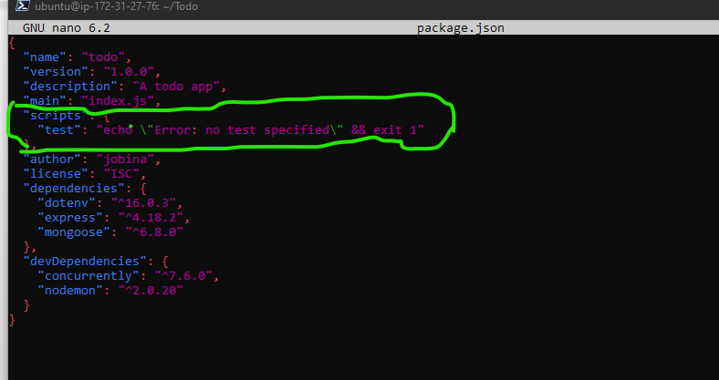 replace this with:

```
"scripts": {
"start": "node index.js",
"start-watch": "nodemon index.js",
"dev": "concurrently \"npm run start-watch\" \"cd client && npm start\""
},

```

# Configure Proxy in package.json

- Change directory to ‘client’

`cd client`

- Open the package.json file

`nano package.json`

- Add the key value pair in the package.json file

```
"proxy": `http://localhost:5000`

```

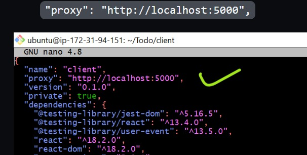 

The purpose of adding the proxy configuration  is to make it possible to access the application directly from the browser by simply calling the server url like http://localhost:5000 rather than always including the entire path like `http://localhost:5000/api/todos`


-   Ensure you are inside the Todo directory, and simply run:

`npm run dev`

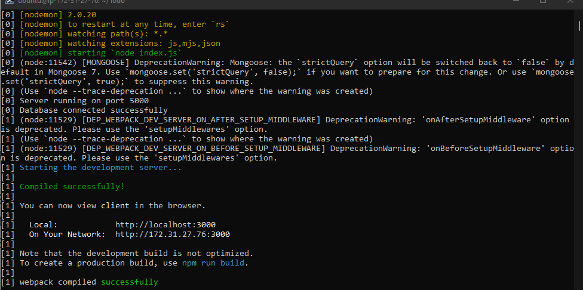

Your app should open and start running on `localhost:3000`
Important note: In order to to access the application from the Internet you have to open TCP port 3000 on EC2 by adding a new Security Group rule.

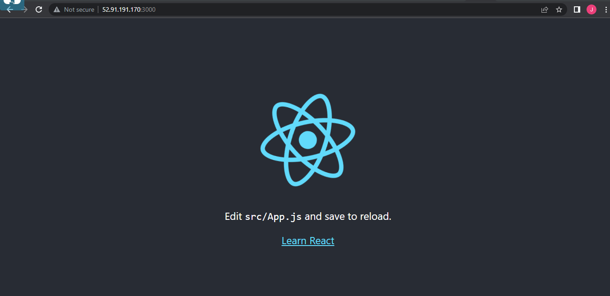

# Creating your React Components

One of the advantages of react is that it makes use of components, which are reusable and also makes code modular. For our Todo app, there will be two stateful components and one stateless component.

- From your Todo directory run:

`cd client`

- move to the src directory

`cd src`

- Inside your src folder create another folder called components

`mkdir components`

- Move into the components directory with

`cd components`

Inside ‘components’ directory create three files Input.js, ListTodo.js and Todo.js.

`touch Input.js ListTodo.js Todo.js`

- Open ***Input.js*** file

`nano Input.js`

- Copy and paste the following code:

```
import React, { Component } from 'react';
import axios from 'axios';
 
class Input extends Component {
 
state = {
action: ""
}
 
addTodo = () => {
const task = {action: this.state.action}
 
    if(task.action && task.action.length > 0){
      axios.post('/api/todos', task)
        .then(res => {
          if(res.data){
            this.props.getTodos();
            this.setState({action: ""})
          }
        })
        .catch(err => console.log(err))
    }else {
      console.log('input field required')
    }
 
}
 
handleChange = (e) => {
this.setState({
action: e.target.value
})
}
 
render() {
let { action } = this.state;
return (
<div>
<input type="text" onChange={this.handleChange} value={action} />
<button onClick={this.addTodo}>add todo</button>
</div>
)
}
}
 
export default Input

```

We are going to install [Axios](https://github.com/axios/axios). Axios is a Promise based HTTP client for the browser and node.js.

Move to the Todo directory. To move to the Todo directory, Run

`cd ..` multiple times until you are in the Todo directory. 

- Install Axios

`npm install axios`

Go to ‘components’ directory

`cd src/components`

- Open your ***ListTodo.js***

`nano ListTodo.js`

- Delete the previous code and paste

```
import React from 'react';
 
const ListTodo = ({ todos, deleteTodo }) => {
 
return (
<ul>
{
todos &&
todos.length > 0 ?
(
todos.map(todo => {
return (
<li key={todo._id} onClick={() => deleteTodo(todo._id)}>{todo.action}</li>
)
})
)
:
(
<li>No todo(s) left</li>
)
}
</ul>
)
}
 
export default ListTodo

```

- Then in your ***Todo.js*** file  delete the previous code, cop and paste the following code

```
import React, {Component} from 'react';
import axios from 'axios';
 
import Input from './Input';
import ListTodo from './ListTodo';
 
class Todo extends Component {
 
state = {
todos: []
}
 
componentDidMount(){
this.getTodos();
}
 
getTodos = () => {
axios.get('/api/todos')
.then(res => {
if(res.data){
this.setState({
todos: res.data
})
}
})
.catch(err => console.log(err))
}
 
deleteTodo = (id) => {
 
    axios.delete(`/api/todos/${id}`)
      .then(res => {
        if(res.data){
          this.getTodos()
        }
      })
      .catch(err => console.log(err))
 
}
 
render() {
let { todos } = this.state;
 
    return(
      <div>
        <h1>My Todo(s)</h1>
        <Input getTodos={this.getTodos}/>
        <ListTodo todos={todos} deleteTodo={this.deleteTodo}/>
      </div>
    )
 
}
}
 
export default Todo;

```

We going to make some adjustment to our react code. Delete the logo and adjust our App.js.

- Move to the src directory

`cd ..`

- In the src directoryrun:

`nano App.js`

- Delete the previous code and paste this:

```
App.js
import React from 'react';
 
import Todo from './components/Todo';
import './App.css';
 
const App = () => {
return (
<div className="App">
<Todo />
</div>
);
}
 
export default App;

```

- In the src directory open the ***App.css***

`vi App.css`

```

.App {
text-align: center;
font-size: calc(10px + 2vmin);
width: 60%;
margin-left: auto;
margin-right: auto;
}
 
input {
height: 40px;
width: 50%;
border: none;
border-bottom: 2px #101113 solid;
background: none;
font-size: 1.5rem;
color: #787a80;
}
 
input:focus {
outline: none;
}
 
button {
width: 25%;
height: 45px;
border: none;
margin-left: 10px;
font-size: 25px;
background: #101113;
border-radius: 5px;
color: #787a80;
cursor: pointer;
}
 
button:focus {
outline: none;
}
 
ul {
list-style: none;
text-align: left;
padding: 15px;
background: #171a1f;
border-radius: 5px;
}
 
li {
padding: 15px;
font-size: 1.5rem;
margin-bottom: 15px;
background: #282c34;
border-radius: 5px;
overflow-wrap: break-word;
cursor: pointer;
}
 
@media only screen and (min-width: 300px) {
.App {
width: 80%;
}
 
input {
width: 100%
}
 
button {
width: 100%;
margin-top: 15px;
margin-left: 0;
}
}
 
@media only screen and (min-width: 640px) {
.App {
width: 60%;
}
 
input {
width: 50%;
}
 
button {
width: 30%;
margin-left: 10px;
margin-top: 0;
}
}

```

- In the src directory open the ***index.css***

`nano index.css`

- Delete the previous code, copy and paste the following:

```
body {
margin: 0;
padding: 0;
font-family: -apple-system, BlinkMacSystemFont, "Segoe UI", "Roboto", "Oxygen",
"Ubuntu", "Cantarell", "Fira Sans", "Droid Sans", "Helvetica Neue",
sans-serif;
-webkit-font-smoothing: antialiased;
-moz-osx-font-smoothing: grayscale;
box-sizing: border-box;
background-color: #282c34;
color: #787a80;
}
 
code {
font-family: source-code-pro, Menlo, Monaco, Consolas, "Courier New",
monospace;
}

```

- Go to the Todo directory

`cd .. \ cd ..`

- In the Todo directory run:

`npm run dev`

If all configurations have been done correctly wihout any errors when saving all these files, our To-Do app should be ready and fully functional with the functionality discussed earlier: creating a task, deleting a task and viewing all your tasks.


 


 


  


