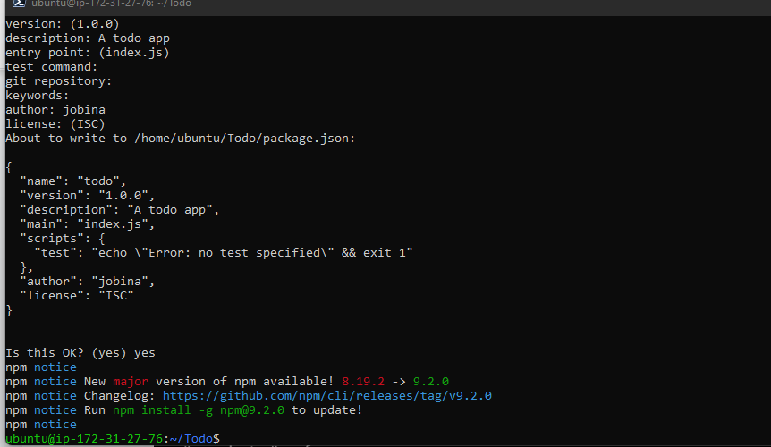
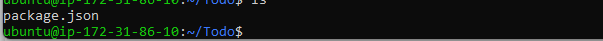

# MERN-STACK-IMPLEMENTATION AWS


MERN stack is a collection of technologies that enables faster application development. It is used by developers worldwide. The main purpose of using MERN stack is to develop apps using JavaScript only. This is because the four technologies that make up the technology stack are all JS-based.

The four technologies are

- MongoDB : This is document-based, No-SQL database used to store application data in a form of documents.
- ExpressJS:  This is a server-side Web Application framework for Node.js.
- React: This is a frontend framework developed by Facebook. It is based on JavaScript, used to build User Interface (UI) components.     
- NodeJS:This is a JavaScript runtime environment. It is used to run JavaScript on a machine rather than in a browser.
#  Project Overview:
   We are going to install and illustrate how a user interacts with the ReactJS UI components at the application front-end residing in the browser. This frontend is served by the application backend residing in a server, through ExpressJS running on top of NodeJS. Any interaction that causes a data change, request is sent to the NodeJS based Express server, which grabs data from the MongoDB database if required, and returns the data to the frontend of the application, which is then presented to the user.

 # Project prerequisite:
  
 - AWS account (free tier)
 - Basic understanding of setting up an Ec2 Instance.

Lets get the show on the road 🏋️‍♀️😊

# Step 1.
- Sign in to AWS free tier account
-  Launch a new EC2 Instance
-  t2.nano family with Ubuntu Server 22.04 LTS (HVM) image.
-  Create and download a key pair (a .pem key) for conection to the account
-  Launch instance
- Connect to your instance with your .pem key.

# Step 2. Backend Configuration.

- Update ubuntu: `sudo apt update`
- Upgrade ubuntu:  `sudo apt upgrade`
-  Get the location of Node.js software from [Ubuntu repositories](https://github.com/nodesource/distributions#deb) This command will load the Node source.

`curl -fsSL https://deb.nodesource.com/setup_18.x | sudo -E bash -`

- Install Node.js with the command below

`sudo apt-get install -y nodejs`


The command above installs both nodejs and npm. NPM is a package manager for Node like apt for Ubuntu, it is used to install Node modules & packages and to manage dependency conflicts.
Verify the node installation with the command below:

`node -v`


Verify the npm installation with the command below:

`npm -v`

 

# Application Code Setup

- Create a new directory for your To-Do project:

`mkdir Todo`

To verify that the Todo directory is created run : 

`ls`

 P.S In order to see some more useful information about files and directories, you can use following combination of keys `ls -lih` 
 
 - It will show you different properties and size in human readable format. 
 - You can learn more about different useful keys for ls command with `ls --help`.

Now change your current directory to the newly created one:

`cd Todo`

- To initialise your project, so that a new file named ***package.json*** will be created run:

`npm init`

This initialsied file contains information about your application and the dependencies that it needs to run. Follow the prompts after running the command.
You should press the Enter  key several times to accept default values, then accept to write out the ***package.json*** file by typing yes.

 

Run the command `ls` to confirm that you have package.json file created.



If you do not see the output above, kindly go back and retake all the steps.

# step 3. Install ExpressJS

- Install, ExpressJs next and create the Routes directory.
Express is a framework for Node.js, therefore a lot of things developers would have programmed  already comes pre-installed. This singular situation, simplifies development, and abstracts a lot of low-level details. For example, Express helps to define routes of your application based on HTTP methods and URLs.

- To use express, install it using npm:

`npm install express`

- Create a file ***index.js*** with the command below:

`touch index.js`

- Run `ls` to confirm that your index.js file has been successfully created

# Install the dotenv module 

- To install the dotenv module run:

`npm install dotenv`

- Open the index.js file with the command below:

`nano index.js`

paste the following code in the editor:

```
const express = require('express');
require('dotenv').config();
 
const app = express();
 
const port = process.env.PORT || 5000;
 
app.use((req, res, next) => {
res.header("Access-Control-Allow-Origin", "\*");
res.header("Access-Control-Allow-Headers", "Origin, X-Requested-With, Content-Type, Accept");
next();
});
 
app.use((req, res, next) => {
res.send('Welcome to Express');
});
 
app.listen(port, () => {
console.log(`Server running on port ${port}`)
});

```
Notice that we have specified to use port 5000 in the code. This will be required later when we go on the browser.
Now it is time to start our server to see if it works. Open your terminal in the same directory as your index.js file and type:

`node index.js`

If your configuration is correct, you should get the following output


- Open port 5000 in your Ec2 Security groups


Open up your browser and try to access your server’s Public IP or Public DNS name followed by port 5000:

`http://<PublicIP-or-PublicDNS>:5000`


Quick reminder on how to get your server’s Public IP and public DNS name:

-  You can find it in your AWS web console in EC2 details

- For Public IP addresss You can also run:
 
 ```
 curl -s http://169.254.169.254/latest/meta-data/public-ipv4
 
 ```
 - Or

 ```

 curl -s http://169.254.169.254/latest/meta-data/public-hostname
 
 ``` 
 - for Public DNS name.

 # Creating Routes Directory
 
There are three actions that our To-Do application needs to be able to do:

- Create a new task

- Display list of all tasks

- Delete a completed task

Each task will be associated with some particular endpoint and will use different standard ***HTTP request methods***: POST, GET, DELETE.
For each task, we need to create ***routes*** that will define various endpoints that the ***To-do app*** will depend on. 

-  create a folder routes:

`mkdir routes`
  
- Change directory to routes folder:

`cd routes`

Now, create a file api.js with the command below

`touch api.js`

- Open the file with the command below:

`nano api.js`

- Paste the following code in the file.

```
const express = require ('express');
const router = express.Router();
 
router.get('/todos', (req, res, next) => {
 
});
 
router.post('/todos', (req, res, next) => {
 
});
 
router.delete('/todos/:id', (req, res, next) => {
 
})
 
module.exports = router;
```

# Creating  Models directory.


